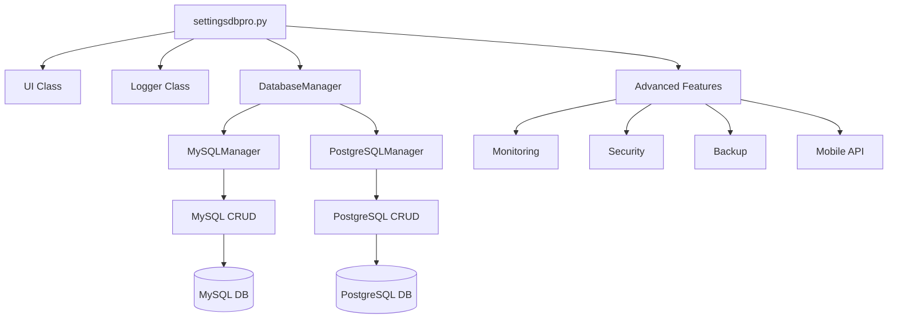

# PROFESSIONAL DATABASE MANAGEMENT SYSTEM

<div align="center">
  
  
  
  
  
</div>

## 📋 Mundarija

- [Loyiha haqida](#-loyiha-haqida)
- [Asosiy imkoniyatlar](#-asosiy-imkoniyatlar)
- [Arxitektura](#-arxitektura)
- [O'rnatish](#-o'rnatish)
- [Ishga tushirish](#-ishga-tushirish)
- [Modullar tavsifi](#-modullar-tavsifi)
- [Database model](#-database-model)
- [API dokumentatsiyasi](#-api-dokumentatsiyasi)
- [Kod tuzilishi](#-kod-tuzilishi)
- [Xatolarni bartaraf qilish](#-xatolarni-bartaraf-qilish)
- [Hissa qo'shish](#-hissa-qo'shish)
- [Litsenziya](#-litsenziya)

## 🎯 Loyiha haqida

**Professional Database Management System** - bu MySQL va PostgreSQL ma'lumotlar bazalarini to'liq boshqarish uchun yaratilgan kuchli va ko'p funksiyali vositadir. Dastur CLI (Command Line Interface) orqali ishlaydi va barcha asosiy database operatsiyalarini avtomatlashtiradi.

### 🏗️ Loyiha tarkibi

| Fayl nomi | Tavsifi |
|-----------|---------|
| `settingsdbpro.sh` | Bash skript - MySQL va PostgreSQL boshqaruvi (orignal versiya) |
| `settingsdbpro.py` | Python skript - To'liq funksiyalli dastur (yangilangan versiya) |
| `db_manager.py` | Umumiy database model - MySQL/PostgreSQL CRUD operatsiyalari |
| `mysql_model.py` | MySQL uchun maxsus model |
| `postgresql_model.py` | PostgreSQL uchun maxsus model |
| `test_model.py` | Database model test skripti |
| `requirements.txt` | Kerakli Python kutubxonalar ro'yxati |
| `Dockerfile` | Docker konteyner yaratish uchun |
| `docker-compose.yml` | Docker Compose konfiguratsiyasi |

## ✨ Asosiy imkoniyatlar

### 🔧 **Ma'lumotlar bazasi boshqaruvi**
- ✅ MySQL to'liq boshqaruv (foydalanuvchilar, database'lar, ruxsatlar)
- ✅ PostgreSQL to'liq boshqaruv (foydalanuvchilar, database'lar, ruxsatlar)
- ✅ Real-time monitoring (CPU, RAM, Disk, tarmoq)
- ✅ Avtomatik backup va restore
- ✅ Incremental va differential backup
- ✅ Cloud backup (AWS S3, Google Cloud, Yandex Cloud)

### 📊 **Monitoring va Analytics**
- ✅ Real-time dashboard (terminal va web)
- ✅ Grafik dashboard (PNG format)
- ✅ Predictive analytics (AI asosida o'sish bashorati)
- ✅ Anomaliya detektori
- ✅ SLA monitoring (uptime hisoblash)
- ✅ Performans tahlili

### 🔐 **Xavfsizlik**
- ✅ SSL sertifikat yaratish
- ✅ Firewall sozlamalari
- ✅ Audit log
- ✅ Data masking va anonimlashtirish
- ✅ Database encryption (shifrlash)
- ✅ VPN sozlash (WireGuard)

### 📱 **Qo'shimcha imkoniyatlar**
- ✅ Mobile API (REST)
- ✅ Plugin system
- ✅ Docker integration
- ✅ Health checks
- ✅ Performance tuning advisor
- ✅ Replication monitoring

## 🏗️ Arxitektura



## 📦 O'rnatish

### 1. **Repositoriyani klonlash**

```bash
git clone https://github.com/yourusername/db-manager.git
cd db-manager
```

### 2. **Python muhitini sozlash**

```bash
# Virtual environment yaratish
python3 -m venv venv
source venv/bin/activate  # Linux/Mac
# yoki
venv\Scripts\activate  # Windows
```

### 3. **Kerakli kutubxonalarni o'rnatish**

```bash
# requirements.txt orqali
pip install -r requirements.txt

# Yoki alohida
pip install psutil requests schedule reportlab docker boto3 kubernetes flask cryptography matplotlib numpy scikit-learn pyjwt sqlalchemy pymysql psycopg2-binary
```

### 4. **Database serverlarni o'rnatish**

#### MySQL
```bash
sudo apt update
sudo apt install mysql-server -y
sudo mysql_secure_installation
sudo systemctl start mysql
sudo systemctl enable mysql
```

#### PostgreSQL
```bash
sudo apt install postgresql postgresql-contrib -y
sudo systemctl start postgresql
sudo systemctl enable postgresql
sudo -u postgres psql -c "ALTER USER postgres WITH PASSWORD 'postgres';"
```

### 5. **Test database yaratish**

```bash
# MySQL
sudo mysql -e "CREATE DATABASE IF NOT EXISTS test_db;"
sudo mysql -e "CREATE USER IF NOT EXISTS 'test_user'@'localhost' IDENTIFIED BY 'test_pass';"
sudo mysql -e "GRANT ALL PRIVILEGES ON test_db.* TO 'test_user'@'localhost';"
sudo mysql -e "FLUSH PRIVILEGES;"

# PostgreSQL
sudo -u postgres psql -c "CREATE DATABASE test_db;"
sudo -u postgres psql -c "CREATE USER test_user WITH PASSWORD 'test_pass';"
sudo -u postgres psql -c "GRANT ALL PRIVILEGES ON DATABASE test_db TO test_user;"
```

## 🚀 Ishga tushirish

### **Asosiy dastur (Python versiya)**

```bash
# Root huquqlari bilan ishga tushirish
sudo python3 settingsdbpro.py

# Real-time monitoring
sudo python3 settingsdbpro.py --monitor

# Backup olish
sudo python3 settingsdbpro.py --backup mysql
sudo python3 settingsdbpro.py --backup postgresql

# Health check
sudo python3 settingsdbpro.py --health

# Dashboard yaratish
sudo python3 settingsdbpro.py --dashboard

# Predictive analytics
sudo python3 settingsdbpro.py --predict 30

# Mobile API
sudo python3 settingsdbpro.py --mobile
```

### **Bash skript versiya**

```bash
# Bajarish huquqini berish
chmod +x settingsdbpro.sh

# Ishga tushirish
sudo ./settingsdbpro.sh
```

### **Database model test**

```bash
# Model test qilish
python3 test_model.py

# Python konsolida test
python3
>>> from db_manager import DatabaseManager
>>> db = DatabaseManager(db_type='mysql', user='root', password='your_pass', database='test_db')
>>> db.connect()
>>> db.create_user(123456789, 100.50)
>>> db.get_balance(123456789)
100.5
```

### **Docker orqali**

```bash
# Docker image build
docker build -t db-manager .

# Container run
docker run -it --rm db-manager

# Docker Compose
docker-compose up
```

## 📚 Modullar tavsifi

### **1. settingsdbpro.sh (Bash versiya)**

Bash tilida yozilgan asosiy skript. MySQL va PostgreSQL ni boshqarish uchun oddiy interfeys.

**Imkoniyatlar:**
- MySQL o'rnatish, holatini ko'rish, qayta ishga tushirish
- Foydalanuvchi yaratish, o'chirish, parol o'zgartirish
- Ruxsatlar berish va olib tashlash
- Ma'lumotlar bazasi yaratish va o'chirish
- Backup/Restore
- Kesh tozalash

### **2. settingsdbpro.py (Python versiya)**

Python'da yozilgan to'liq funksiyalli dastur. Barcha advanced imkoniyatlarni o'z ichiga oladi.

**Klasslar:**
- `UI` - foydalanuvchi interfeysi
- `Logger` - loglash tizimi
- `DatabaseManager` - umumiy database funksiyalari
- `MySQLManager` - MySQL maxsus funksiyalari
- `PostgreSQLManager` - PostgreSQL maxsus funksiyalari
- `MonitoringManager` - monitoring va analytics
- `EnhancedMonitoring` - kengaytirilgan monitoring
- `PredictiveAnalytics` - AI asosida bashorat qilish
- `ReplicationManager` - replikatsiya monitoring
- `AdvancedSecurity` - xavfsizlik funksiyalari
- `PerformanceAdvisor` - performans sozlash
- `MobileAPI` - REST API
- `HealthChecker` - sog'liq tekshiruvi
- `PluginManager` - plugin tizimi
- `SLAMonitor` - SLA monitoring
- `DataMasking` - ma'lumotlarni masking qilish
- `CacheManager` - kesh tozalash
- `Utils` - umumiy yordamchi funksiyalar

### **3. db_manager.py (Database model)**

SQLAlchemy ORM asosidagi database model. MySQL va PostgreSQL bilan ishlaydi.

**Klasslar:**
- `UserBalance` - foydalanuvchi balans modeli
- `DatabaseManager` - database boshqaruvchi klass

**CRUD operatsiyalari:**
- `create_user(chat_id, initial_balance)` - yaratish
- `get_user(chat_id)` - olish
- `update_balance(chat_id, amount, operation)` - yangilash
- `delete_user(chat_id)` - o'chirish
- `list_users(limit)` - ro'yxatlash

**Qo'shimcha funksiyalar:**
- `add_money(chat_id, amount)` - pul qo'shish
- `subtract_money(chat_id, amount)` - pul ayirish
- `set_money(chat_id, amount)` - balans o'rnatish
- `transfer_money(from_id, to_id, amount)` - pul o'tkazish
- `get_statistics()` - statistika
- `get_top_users(limit)` - eng katta balans egalari
- `search_users(search_term)` - qidiruv

## 💾 Database model

### **Jadval tuzilishi**

```sql
CREATE TABLE user_balances (
    id INT PRIMARY KEY AUTO_INCREMENT,
    chat_id BIGINT NOT NULL UNIQUE,
    balans DECIMAL(10,2) DEFAULT 0.00 NOT NULL,
    created_at DATETIME DEFAULT CURRENT_TIMESTAMP,
    updated_at DATETIME DEFAULT CURRENT_TIMESTAMP ON UPDATE CURRENT_TIMESTAMP,
    INDEX idx_chat_id (chat_id),
    INDEX idx_balans (balans)
);
```

### **Model xususiyatlari**

| Maydon | Tip | Tavsifi |
|--------|-----|---------|
| `id` | Integer | Primary key, avtomatik o'sadi |
| `chat_id` | BigInteger | Telegram ID, unique, not null |
| `balans` | Numeric(10,2) | Foydalanuvchi balansi, default 0.00 |
| `created_at` | DateTime | Yaratilgan vaqt |
| `updated_at` | DateTime | Yangilangan vaqt |

## 📡 API dokumentatsiyasi

### **Mobile API endpoints**

| Method | Endpoint | Tavsifi |
|--------|----------|---------|
| POST | `/api/login` | Login qilish |
| GET | `/api/verify` | Token tekshirish |
| GET | `/api/status` | Database status |
| GET | `/api/databases` | Database ro'yxati |
| POST | `/api/backup` | Backup yaratish |

### **Example requests**

```bash
# Login
curl -X POST http://localhost:5001/api/login \
  -H "Content-Type: application/json" \
  -d '{"username":"admin","password":"admin"}'

# Status
curl -X GET http://localhost:5001/api/status \
  -H "Authorization: Bearer YOUR_TOKEN"

# Backup
curl -X POST http://localhost:5001/api/backup \
  -H "Authorization: Bearer YOUR_TOKEN" \
  -H "Content-Type: application/json" \
  -d '{"type":"mysql","database":"test_db"}'
```

## 📁 Kod tuzilishi

```
project/
├── settingsdbpro.sh          # Bash skript
├── settingsdbpro.py          # Python dastur (asosiy)
├── db_manager.py             # Database model (umumiy)
├── mysql_model.py            # MySQL maxsus model
├── postgresql_model.py       # PostgreSQL maxsus model
├── test_model.py             # Test skript
├── requirements.txt          # Python kutubxonalar
├── Dockerfile                # Docker konfiguratsiya
├── docker-compose.yml        # Docker Compose
├── README.md                 # Dokumentatsiya
├── .gitignore                # Git ignore
├── LICENSE                   # Litsenziya
│
├── db_configs/               # Konfiguratsiya fayllari
├── db_backups/               # Backup fayllar
├── db_logs/                  # Log fayllar
├── db_ssl/                   # SSL sertifikatlar
├── db_temp/                  # Vaqtinchalik fayllar
├── db_cache/                 # Kesh fayllar
├── db_data/                  # Ma'lumotlar
├── db_archive/               # Arxivlar
├── db_reports/               # Hisobotlar
├── db_alerts/                |# Ogohlantirishlar
├── db_migrations/            # Migratsiya fayllari
├── db_plugins/               # Pluginlar
└── db_dashboards/            # Dashboard grafiklari
```

## 🔧 Xatolarni bartaraf qilish

### **1. MySQL ulanish xatosi**

```bash
# MySQL holatini tekshirish
sudo systemctl status mysql

# MySQL ni qayta ishga tushirish
sudo systemctl restart mysql

# MySQL login ma'lumotlarini tekshirish
sudo mysql -u root -p
```

### **2. PostgreSQL ulanish xatosi**

```bash
# PostgreSQL holatini tekshirish
sudo systemctl status postgresql

# PostgreSQL ni qayta ishga tushirish
sudo systemctl restart postgresql

# PostgreSQL login
sudo -u postgres psql
```

### **3. Python kutubxona xatolari**

```bash
# Kutubxonalarni yangilash
pip install --upgrade pip
pip install --upgrade -r requirements.txt

# Virtual muhitni qayta yaratish
rm -rf venv
python3 -m venv venv
source venv/bin/activate
pip install -r requirements.txt
```

### **4. "module not found" xatosi**

```bash
# Kerakli modulni o'rnatish
pip install missing-module-name

# Barcha modullarni o'rnatish
pip install -r requirements.txt
```

### **5. "permission denied" xatosi**

```bash
# Root huquqlari bilan ishga tushirish
sudo python3 settingsdbpro.py

# Fayl ruxsatlarini to'g'rilash
chmod +x settingsdbpro.sh
sudo chown -R $USER:$USER .
```

## 🤝 Hissa qo'shish

1. Fork qiling
2. Yangi branch yarating (`git checkout -b feature/AmazingFeature`)
3. O'zgartirishlarni commit qiling (`git commit -m 'Add some AmazingFeature'`)
4. Branch'ni push qiling (`git push origin feature/AmazingFeature`)
5. Pull Request yarating

## 📄 Litsenziya

Bu loyiha MIT litsenziyasi ostida tarqatiladi. Batafsil ma'lumot uchun `LICENSE` faylini o'qing.

## 👨‍💻 Muallif

**Database Administrator**
- GitHub: [@yourusername](https://github.com/yourusername)
- Email: admin@localhost
- Telegram: [@yourusername](https://t.me/yourusername)

## 🙏 Maxsus rahmat

- [SQLAlchemy](https://www.sqlalchemy.org/) - ORM uchun
- [Flask](https://flask.palletsprojects.com/) - Web API uchun
- [psutil](https://github.com/giampaolo/psutil) - Monitoring uchun
- [scikit-learn](https://scikit-learn.org/) - AI/ML uchun
- [matplotlib](https://matplotlib.org/) - Grafiklar uchun
- Barcha contributorlar va foydalanuvchilarga

---

<div align="center">
  <sub>Build with ❤️ for the developer community</sub>
  <br>
  <sub>© 2024 Professional Database Management System</sub>
</div>
```

## `requirements.txt`

```txt
# Asosiy kutubxonalar
psutil>=5.8.0
requests>=2.26.0
schedule>=1.1.0
colorama>=0.4.4

# Web framework
flask>=2.0.0
pyjwt>=2.0.0

# Database
sqlalchemy>=1.4.0
pymysql>=1.0.0
psycopg2-binary>=2.9.0

# Security
cryptography>=3.4.0

# Monitoring va grafiklar
matplotlib>=3.5.0
numpy>=1.21.0
scikit-learn>=1.0.0

# Reporting
reportlab>=3.6.0

# Docker va cloud
docker>=5.0.0
boto3>=1.18.0
kubernetes>=12.0.0

# Development
ipython>=7.0.0
pytest>=6.0.0
```

## `.gitignore`

```gitignore
# Python
__pycache__/
*.py[cod]
*$py.class
*.so
.Python
venv/
env/
ENV/
build/
develop-eggs/
dist/
downloads/
eggs/
.eggs/
lib/
lib64/
parts/
sdist/
var/
wheels/
*.egg-info/
.installed.cfg
*.egg
*.manifest
*.spec

# Virtual environment
venv/
env/
.env
.venv

# IDE
.vscode/
.idea/
*.swp
*.swo
*~

# Database
*.db
*.sqlite3
db_configs/
db_backups/
db_logs/
db_temp/
db_cache/
db_data/
db_archive/
db_reports/
db_alerts/
db_migrations/
db_dashboards/
*.log
*.pid
*.sql.gz
*.encrypted

# OS
.DS_Store
Thumbs.db
*.bak
*.old

# Project specific
*.conf
*.key
*.crt
*.pem
*.pub
*.enc
*.private
```

## `Dockerfile`

```dockerfile
FROM python:3.9-slim

WORKDIR /app

# System dependencies
RUN apt-get update && apt-get install -y \
    mysql-client \
    postgresql-client \
    gcc \
    && rm -rf /var/lib/apt/lists/*

# Python dependencies
COPY requirements.txt .
RUN pip install --no-cache-dir -r requirements.txt

# Application
COPY *.py .
COPY *.sh .
RUN chmod +x *.sh

# Create directories
RUN mkdir -p db_configs db_backups db_logs db_ssl db_temp \
    db_cache db_data db_archive db_reports db_alerts \
    db_migrations db_plugins db_dashboards

ENTRYPOINT ["python3", "settingsdbpro.py"]
CMD ["--help"]
```

## `docker-compose.yml`

```yaml
version: '3.8'

services:
  db-manager:
    build: .
    container_name: db-manager
    network_mode: host
    volumes:
      - ./db_configs:/app/db_configs
      - ./db_backups:/app/db_backups
      - ./db_logs:/app/db_logs
      - ./db_ssl:/app/db_ssl
      - ./db_reports:/app/db_reports
    environment:
      - MYSQL_HOST=localhost
      - MYSQL_USER=root
      - MYSQL_PASSWORD=
      - POSTGRES_HOST=localhost
      - POSTGRES_USER=postgres
      - POSTGRES_PASSWORD=postgres
    stdin_open: true
    tty: true
    command: ["--help"]
```

---

Bu `README.md` fayli loyihangiz haqida to'liq ma'lumot beradi va foydalanuvchilarga dasturni o'rnatish va ishlatishda yordam beradi.
